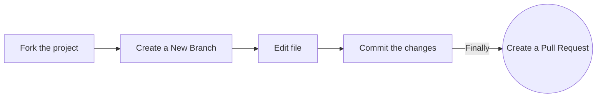

### Option 1. Complete this process in GitHub (in your browser)



1. Fork the project:


- Click the gray <kbd>Fork</kbd> button at the top right of this page. This creates your copy of the project and saves it as a new repository in your GitHub account

2. Create a New Branch:


- On your new repository's page, click the gray main button in the upper left to reveal a dropdown menu.
- Enter the name of your new branch in the text box. (Branch names usually refer to what is being changed. Example: nameAdd).
  -Click on Create branch <new branch name>, which will automatically take you to your new branch. You can make edits on the main branch, but this may cause issues down the line. The best practice is to create a new branch for each separate issue you work on. That way your main branch remains in sync with Eddie's main branch.

3. Edit:

- If you want to change a file just click on the pencil icon on top right of the file name, to edit the file and add necessary changes.
- After editing the necessary changes on the files, add a commit message and click on the green button saying "Commit Changes". Make sure you have selected the branch you have created.

4. Raise a Pull Request:

- Click `Pull Requests` (which is the third option at the top of this page after the options `Code` and `Issues`).
- Click the green New Pull Request button. This will prep the new pull request for you by auto-filling the base repository: base with 'EddieGitHubCommunity: main' AND auto-filling your head repository: compare with your repository: main
- Click on your head repository's `compare` dropdown, and switch branches from your 'main' branch to `<new branch name>`.
- Finally, click the green `Create Pull Request` button. Great job! You did it!

You can ask questions by raising an [issue](https://github.com/ADITYADAS1999/Awesome_Resume_Builder/issues/new/).

### Option 2. Complete this process on your computer (locally)

1. Fork the project:

- Click the gray Fork button at the top right of this page. This creates your copy of the project and saves it as a new repository in your GitHub account

2. Clone this project on your computer:
    
    

    

- Go to your profile. You will find forked repo named **_Awesome_Resume_Builder_**. go to the repo by clicking on it.
- Click on the green Code button, then either the HTTPS or SSH option, and, click the icon to copy the URL. Now you have a copy of the project. Thus, you can play around with it locally on your computer.

- Run the following commands into a terminal window (Command Prompt, Powershell, Terminal, Bash, ZSH). Do this to download the forked copy of this repository to your computer.

```bash
  git clone https://github.com/ADITYADAS1999/Awesome_Resume_Builder.git
```

- Switch to the cloned folder. You can paste this command into the same terminal window.

```bash
  cd Awesome_Resume_Builder
```

3. Create a new branch:

- Your username would make a good branch because it's unique.

```bash
  git checkout -b <name-of-new-branch>
```

4. Edit:


- **Add your necessary changes in the files. Then save your changes.**
    

5. Stage your changes:

```bash
  git add <changes-file-name-with-extension>
```

or

```bash
  git add .
```

6. Commit the changes:

```bash
  git commit -m "Add <your-github-username>"
```

- Check the status of your repository.

```bash
  git status
```

- The response should be like this:

```bash
On branch <name-of-your-branch>
nothing to commit, working tree clean
```

7. Pushing your repository to GitHub:

```bash
  git push origin <name-of-your-branch>
```

or

```bash
  git branch -M main
  git push -u origin main
```

> **Warning**: If you get an error message like the one below, you probably forgot to fork the repository before cloning it. It is best to start over and fork the project repository first.

```bash
ERROR: Permission to ADITYADAS1999/Awesome_Resume_Builder.git denied to <your-github-username>.
fatal: Could not read from remote repository.
Please make sure you have the correct access rights and that the repository exists.
```

8. Raise a Pull Request:

- On the GitHub website, navigate to your forked repo - on the top of the files section, you'll notice a new section containing a `Compare & Pull Request` button!

- Click on that button, this will load a new page, comparing the local branch in your forked repository against the main branch in the Awesome_Resume_Builder repository. Do not make any changes in the selected values of the branches (do so only if needed), and click the green `Create Pull Request` button. After creating the PR (Pull Request), 
  Note: A pull request allows us to merge your changes with the original project repo.

- Your pull request will be reviewed and then eventually merged.

Hurray! You successfully made your first contribution! 🎉

---
